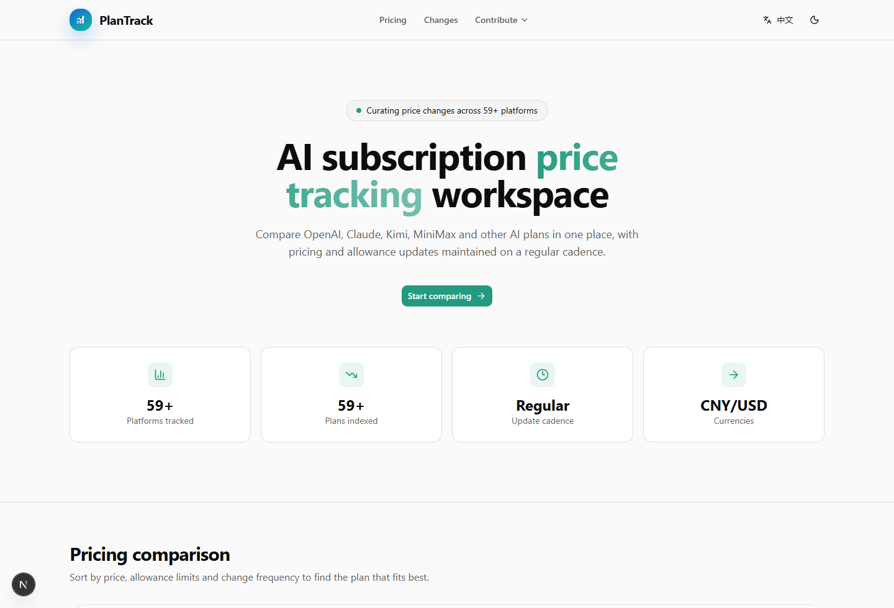

# PlanTrack

[简体中文说明](./README.zh-CN.md)

PlanTrack is a price comparison and change-tracking site for AI subscriptions. It helps you quickly compare monthly pricing, quota, billing model, and recent plan changes across major AI services.

It currently focuses on products such as `ChatGPT / Claude / Gemini / Cursor / Kimi / MiniMax / OpenRouter`.

## Preview

## What You Can Do

- Compare pricing and billing models across different AI subscription plans
- Review supported models, quota details, and plan limits
- Track recent pricing and plan changes in one place
- Quickly screen plans that fit your budget and workflow

## Highlights

- High-density pricing comparison interface
- Change tracking and historical updates
- Bilingual Chinese / English interface
- Light and dark theme support
- Information architecture tailored for AI subscription research

## Feedback

- Submit a new platform or plan via GitHub Issue
- Report incorrect data via GitHub Issue
- Contact: `hi@uvlio.com`
