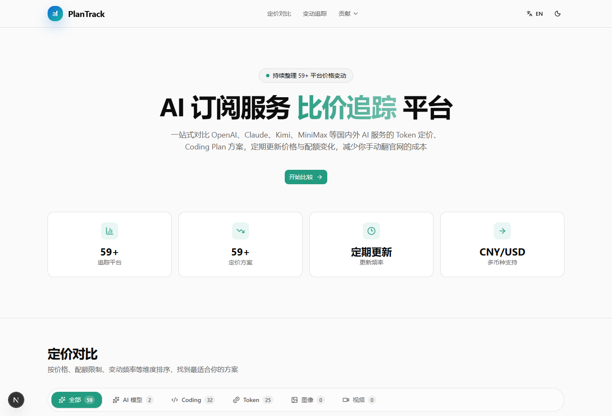

# PlanTrack

[English README](./README.md)

PlanTrack 是一个面向 AI 订阅方案的价格对比与变动追踪站点，帮助你快速查看不同产品的月费、配额、计费方式和最近变化。

目前聚焦的产品包括 `ChatGPT / Claude / Gemini / Cursor / Kimi / MiniMax / OpenRouter` 等主流 AI 服务。

## 预览

## 你可以做什么

- 对比不同 AI 订阅方案的价格与计费方式
- 查看平台支持的模型、配额和限制说明
- 浏览最近的价格与方案变动
- 通过公开页面快速筛选适合自己的订阅方案

## 特点

- 高密度价格对比视图
- 变动追踪与历史记录展示
- 中英双语界面
- 浅色 / 深色主题支持
- 面向 AI 订阅场景的专用信息架构

## 反馈

- 提交新平台 / 新套餐：GitHub Issue
- 报告数据问题：GitHub Issue
- 联系邮箱：`hi@uvlio.com`
